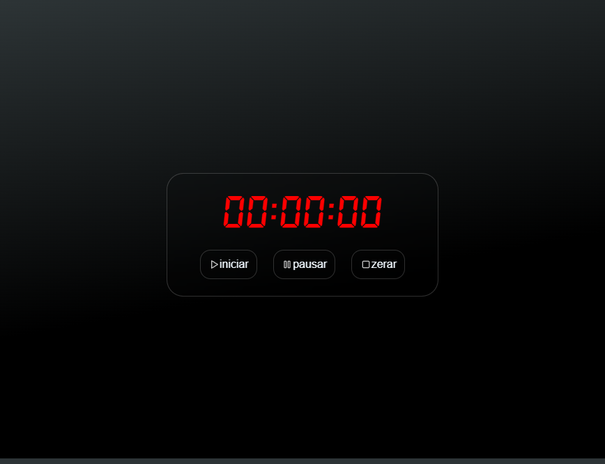

# Just a Timer

  <a href="#-tecnologias">Tecnologias</a>&nbsp;&nbsp;&nbsp;|&nbsp;&nbsp;&nbsp;
  <a href="#-projeto">Projeto</a>&nbsp;&nbsp;&nbsp;|&nbsp;&nbsp;&nbsp;
  <a href="#-license">Licença</a>&nbsp;&nbsp;&nbsp;

     
    
    
  

 

---

## 🧪 Tecnologias

Esse projeto foi desenvolvido com as seguintes tecnologias:

- [HTML5]
- [CSS3]
- [JavaScript]

---

## 💻 Projeto

Just a timer, como o nome sugere é um timer extremamente simples com funcionalidades de pausar, resetar e continuar o tempo.

---

## 📝 License

Esse projeto está sob a licença MIT.

---
