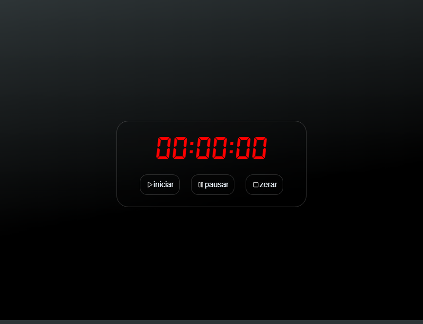
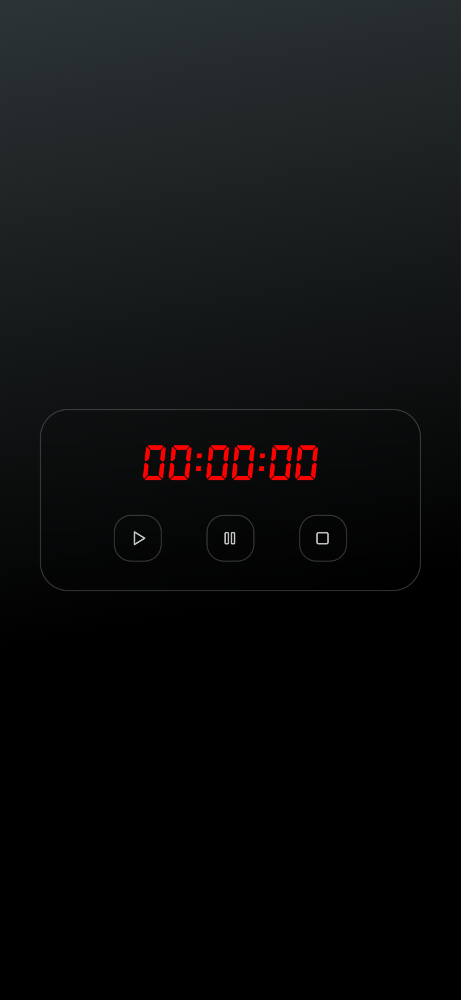
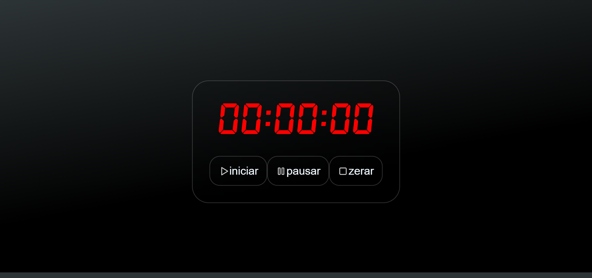

#  Just a Timer
  
  

  <a href="#-tecnologias">Tecnologias</a>&nbsp;&nbsp;&nbsp;|&nbsp;&nbsp;&nbsp;
  <a href="#-projeto">Projeto</a>&nbsp;&nbsp;&nbsp;|&nbsp;&nbsp;&nbsp;
  <a href="#-License">Licença</a>&nbsp;&nbsp;&nbsp;

  

  
  
  

  
 
  
---
  
##  🧪 Tecnologias
  
  
Esse projeto foi desenvolvido com as seguintes tecnologias:
  
- [HTML5]
- [CSS3]
- [JavaScript]
  
---
  
##  💻 Projeto
  
  
Just a timer, como o nome sugere é um timer extremamente simples com funcionalidades de pausar, resetar e continuar o tempo.
  
---
  
##  📝 License
  
  
Esse projeto está sob a licença MIT.
  
---
  